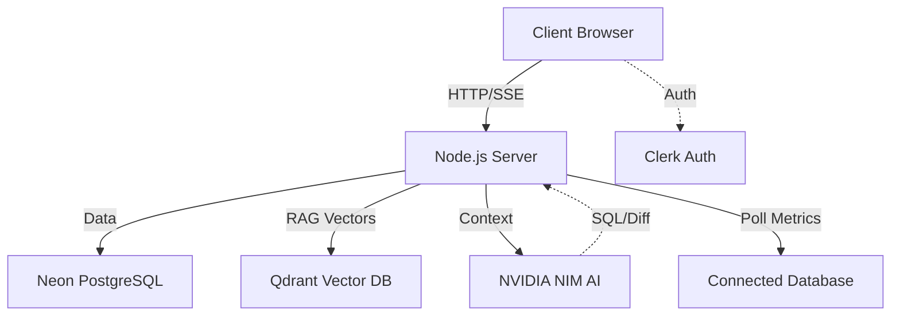

<div align="center">
  <h1>✨ QuerySage</h1>
  <p><strong>AI-Powered PostgreSQL Query Optimizer & Analyzer</strong></p>
  <p><strong>🔗 Live Demo: <a href="https://querysage.vercel.app/">https://querysage.vercel.app/</a></strong></p>
  
  <p>
    
    
    
    
    
  </p>
</div>

---

## 📖 Overview

**QuerySage** is an intelligent workspace that helps developers and DBAs write faster, more efficient SQL queries. Instead of wrestling with slow performance and complex query planners, you can leverage advanced AI to automatically analyze, optimize, and simulate index improvements—all within a seamless, premium interface.

---

## 🚀 Features

- 🧠 **AI Optimization & Cost Analysis:** Instantly analyze slow queries. AI rewrites your query for maximum performance and parses EXPLAIN outputs to estimate exact execution costs.
- 🔍 **Schema-Aware RAG Chat:** Indexes your schema into **Qdrant Vector DB**, allowing you to chat naturally with the AI to generate highly accurate, hallucination-free SQL.
- 📊 **Visual Query Builder:** Drag and drop tables on an interactive canvas to visually generate complex JOINs.
- ⚡ **Live Performance Monitor:** Connect to any PostgreSQL/MySQL instance to poll `pg_stat_statements` and automatically identify the top 20 slowest queries in real-time.
- 🔄 **Migration Assistant:** Effortlessly translate complex SQL across dialects (e.g., SQL Server to PostgreSQL).
- 🎯 **Index Simulation:** Non-destructively simulate `CREATE INDEX` impacts before running them in production.
- 👥 **Team Workspaces:** Securely collaborate on optimizations using Clerk Organizations.

---

## 🛠️ Technology Stack

- **Frontend:** React, Vite, Tailwind CSS, Shadcn UI, React Flow
- **Backend:** Node.js, Express, Drizzle ORM
- **Databases:** Neon PostgreSQL (History/Users), Qdrant (Vector DB)
- **AI & Auth:** NVIDIA NIM (Llama 3.3 70B), Clerk Auth

---

## 🏗️ Architecture



---

## 📁 Project Structure

```text
querysage/
├── frontend/           # React + Vite (UI, pages, components)
├── backend/            # Express server (API routes, LLM calls)
├── lib/
│   ├── db/             # Drizzle ORM schema & Neon connection
│   ├── api-zod/        # Shared TypeScript types & Zod schemas
│   └── api-client-react/ # Auto-generated React Query hooks
├── pnpm-workspace.yaml # Monorepo config
└── package.json
```

---

## ⚙️ Getting Started

### 1. Prerequisites
- Node.js v18+ and `pnpm`

### 2. Installation
```bash
git clone https://github.com/rishabhsingh8445/query-sage.git
cd query-sage
pnpm install
```

### 3. Environment Variables (`.env`)
```env
DATABASE_URL=your_neon_db_url
NVIDIA_API_KEY=your_nvidia_key
QDRANT_URL=your_qdrant_url
QDRANT_API_KEY=your_qdrant_key
CLERK_SECRET_KEY=your_clerk_secret
VITE_CLERK_PUBLISHABLE_KEY=your_clerk_publishable
```

### 4. Run Locally
```bash
pnpm run dev
```

---
<div align="center">
  <i>"Make your queries run at the speed of thought."</i><br/>
  Built by <strong>Rishabh Singh</strong>
</div>
