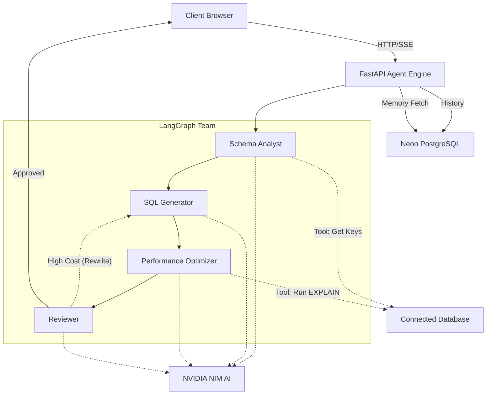

<div align="center">
  <h1>✨ QuerySage (V2 Flagship)</h1>
  <p><strong>Agentic AI-Powered PostgreSQL Query Optimizer & Analyzer</strong></p>
  <p><strong>🔗 Live Demo: <a href="https://querysage.vercel.app/">https://querysage.vercel.app/</a></strong></p>
  
  <p>
    
    
    
    
    
    
  </p>
</div>

---

## 📖 Overview

**QuerySage V2** introduces a fully autonomous, **Agentic AI Architecture** powered by LangGraph. It is a premium workspace that helps developers and DBAs write faster, more efficient SQL queries. Instead of wrestling with slow performance and complex query planners, you can leverage a team of specialized AI agents to automatically analyze schemas, optimize queries, simulate index improvements, and self-correct—all within a seamless, glassmorphism-inspired dark interface.

---

## 🚀 Flagship V2 Features

- 🧠 **Agentic Query Optimizer (Self-Correction Loop):** Powered by LangGraph, a 4-agent team (`Schema Analyst` ➔ `SQL Generator` ➔ `Performance Optimizer` ➔ `Reviewer`) evaluates your queries. If the `Performance Optimizer` detects a high-cost execution plan (e.g., Sequential Scans), the `Reviewer` rejects it, triggering an autonomous self-correction loop until an optimal query is generated.
- ⚡ **Dynamic Agent Trace UI:** Watch the AI think in real-time. The frontend features a sleek, terminal-style trace UI that displays live typewriter logs of agent tools executing (e.g., `✓ Analyzing Schema`, `✓ Running Explain`, `↻ High cost detected. Triggering self-correction loop...`).
- 🧠 **Long-Term Memory & Context Injection:** QuerySage remembers! The AI backend fetches your last 5 slow queries and previous optimizations and injects them into the agent's context, allowing it to learn from past mistakes.
- 🔍 **Timezone-Aware Schema Chat:** Chat naturally with the AI about your schema and database health. The UI automatically injects your local timezone so the AI always provides chronologically accurate insights.
- 📊 **Visual Query Builder:** Drag and drop tables on an interactive canvas to visually generate complex JOINs.
- ⚡ **Live Performance Monitor:** Connect to any PostgreSQL/MySQL instance to poll `pg_stat_statements` and automatically identify the top 20 slowest queries in real-time. (Smartly filters out internal database background jobs).
- 🎯 **Index Simulation:** Non-destructively simulate `CREATE INDEX` impacts before running them in production.
- 👥 **Team Workspaces:** Securely collaborate on optimizations using Clerk Organizations.

---

## 🛠️ Technology Stack

- **Frontend:** React, Vite, Tailwind CSS, Shadcn UI, React Flow
- **AI Backend:** Python, FastAPI, LangGraph, LangChain, Uvicorn
- **Databases:** Neon PostgreSQL (History/Users), Qdrant (Vector DB)
- **AI & Auth:** NVIDIA NIM (Llama 3.3 70B), Clerk Auth

---

## 🏗️ Architecture



---

## 📁 Project Structure

```text
querysage/
├── frontend/           # React + Vite (Glassmorphism UI, Trace Terminal)
├── python-backend/     # FastAPI + LangGraph Engine (4-Agent Team, Tools, Memory)
├── lib/
│   ├── db/             # Drizzle ORM schema & Neon connection
│   └── api-zod/        # Shared TypeScript types
└── pnpm-workspace.yaml # Monorepo config
```

---

## ⚙️ Getting Started

### 1. Prerequisites
- Node.js v18+ and `pnpm`
- Python 3.10+ and `pip`

### 2. Installation
```bash
git clone https://github.com/rishabhsingh8445/query-sage.git
cd query-sage
pnpm install
```

### 3. Environment Variables (`.env` in `python-backend`)
```env
DATABASE_URL=your_neon_db_url
NVIDIA_API_KEY=your_nvidia_key
```

### 4. Run Locally
**Terminal 1 (Frontend):**
```bash
cd frontend
pnpm run dev
```

**Terminal 2 (Python Backend):**
```bash
cd python-backend
pip install -r requirements.txt
uvicorn routes:app --reload --port 8000
```

---
<div align="center">
  <i>"Make your queries run at the speed of thought."</i><br/>
  Built by <strong>Rishabh Singh</strong>
</div>
