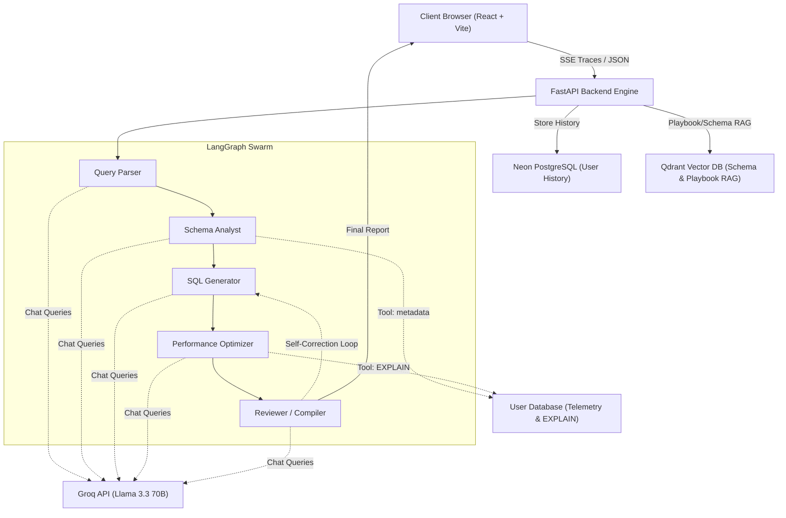

<div align="center">
  <h1>✨ QuerySage</h1>
  <p><strong>Agentic AI-Powered SQL Query Optimizer & Database Architect</strong></p>
  <p><strong>🔗 Live Demo: <a href="https://querysage.vercel.app/">https://querysage.vercel.app/</a></strong></p>
  
  <p>
    
    
    
    
    
    
  </p>
</div>

---

## 📖 Overview

**QuerySage** is an autonomous, multi-agent AI system designed to optimize database queries. Powered by LangGraph, it acts as a virtual team of database administrators (DBAs) that parses input queries, cross-references database schemas, applies dialect-specific optimization guidelines, evaluates execution costs, and builds comprehensive, structured optimization reports.

The application features a sleek dark mode dashboard where users can observe agent tracing in real-time, generate and visualize entity-relationship diagrams (ERDs) from raw DDL, monitor live database performance telemetry, and run non-destructive index simulations.

---

## 🚀 Key Features

- 🧠 **Autonomous Agent Swarm:** Specialized AI agents (`Query Parser`, `Schema Analyst`, `Deep Optimizer`, `Index Advisor`, and `Result Compiler`) run in a LangGraph-coordinated pipeline. When slow operations are detected, the system triggers an autonomous self-correction loop to continuously refine the output.
- ⚡ **Real-Time Agent Tracing:** Live typewriter terminal logs stream agent actions (`✓ Analyzing Schema`, `✓ Running Explain`, `↻ High cost detected. Triggering self-correction loop...`), giving deep visibility into the AI's reasoning.
- 📚 **Playbook & History Matching:** Integrates with Qdrant to match queries against structured performance tuning guidelines and historical optimization profiles. Groq handles semantic routing and context filtering.
- 📊 **Visual ERD Canvas:** Convert SQL DDL commands into interactive nodes and visual relationships on a fully responsive diagram canvas.
- ⏱️ **Live Database Telemetry:** Connect securely to database instances to monitor live active connections, cache hit ratios, missing indexes, and slow-running operations.
- 👥 **Secure Auth & Workspaces:** Fully managed authentication, history tracking, and workspace sharing built on Clerk.

---

## 🏗️ Architecture


```mermaid
graph TD
    %% Core Nodes
    Client["Client Browser (React + Vite)"]
    PythonAPI["FastAPI Backend Engine"]
    Neon["Neon PostgreSQL (User History)"]
    Qdrant["Qdrant Vector DB (Schema & Playbook RAG)"]
    LLM["Groq API (Llama 3.3 70B)"]
    LiveDB["User Database (Telemetry & EXPLAIN)"]

    %% LangGraph Agents
    subgraph "LangGraph Swarm"
        Parser["Query Parser"]
        Schema["Schema Analyst"]
        Gen["SQL Generator"]
        Opt["Performance Optimizer"]
        Rev["Reviewer / Compiler"]
    end

    %% Edges
    Client -->|"SSE Traces / JSON"| PythonAPI
    PythonAPI -->|"Store History"| Neon
    PythonAPI -->|"Playbook/Schema RAG"| Qdrant
    PythonAPI --> Parser
    Parser --> Schema
    Schema --> Gen
    Gen --> Opt
    Opt --> Rev
    Rev -.->|"Self-Correction Loop"| Gen
    Rev -->|"Final Report"| Client
    
    %% API Integrations
    Schema -.->|"Tool: metadata"| LiveDB
    Opt -.->|"Tool: EXPLAIN"| LiveDB
    
    %% Core LLM/Embedding calls
    Parser & Schema & Gen & Opt & Rev -.->|"Chat Queries"| LLM
```

---

## 🛠️ Technology Stack

- **Frontend:** React, Vite, Tailwind CSS, Shadcn UI, React Flow, Zustand
- **Backend:** Python 3.11, FastAPI, LangGraph, LangChain, SQLAlchemy, Uvicorn
- **Databases:** Neon PostgreSQL (Metadata & history), Qdrant (RAG Vector Store)
- **APIs & Auth:** Groq (LLM engine & RAG Router), Clerk (Session security)

---

## ⚙️ Environment Configuration

Create a `.env` file in the `python-backend/` directory:

```env
# Database Configuration (Neon PostgreSQL)
DATABASE_URL=postgresql://<user>:<password>@<host>/<db>?sslmode=require

# AI Model Credentials
GROQ_API_KEY=gsk_...         # Primary LLM Optimizer (Llama 3.3) & RAG routing

# Vector Database (RAG Playbook)
QDRANT_URL=http://localhost:6333
QDRANT_API_KEY=...           # Optional Qdrant API key

# Clerk Auth
CLERK_SECRET_KEY=sk_test_...
CLERK_FRONTEND_API=https://...
ENVIRONMENT=development
```

---

## 🚀 Running Locally

### 1. Backend Setup
```bash
cd python-backend
pip install -r requirements.txt
python main.py
```
*Runs backend server locally on `http://localhost:8000`*

### 2. Frontend Setup
Make sure you have your Clerk keys in `frontend/.env.development`:
```env
VITE_CLERK_PUBLISHABLE_KEY=pk_test_...
VITE_API_URL=http://localhost:8000
```

```bash
cd frontend
pnpm install
pnpm run dev
```

---

## 📁 Repository Structure

```text
querysage/
├── frontend/             # React + Vite application
│   ├── src/
│   │   ├── components/   # UI elements (Agent Swarm UI, Explain Graph, ERD)
│   │   ├── pages/        # Main pages (Landing, Optimizer Chat, Stats Page)
│   │   └── utils/        # Parsers & Helper utilities
├── python-backend/       # FastAPI LangGraph application
│   ├── routes.py         # SSE & HTTP endpoints
│   ├── graph.py          # LangGraph structure & Node definitions
│   ├── rag.py            # Local SQL and text-based keyword RAG pipelines
│   └── tools.py          # Database inspection tools
```

---
<div align="center">
  <i>"Writing performant SQL at the speed of thought."</i><br/>
  Built by <strong>Rishabh Singh</strong>
</div>
