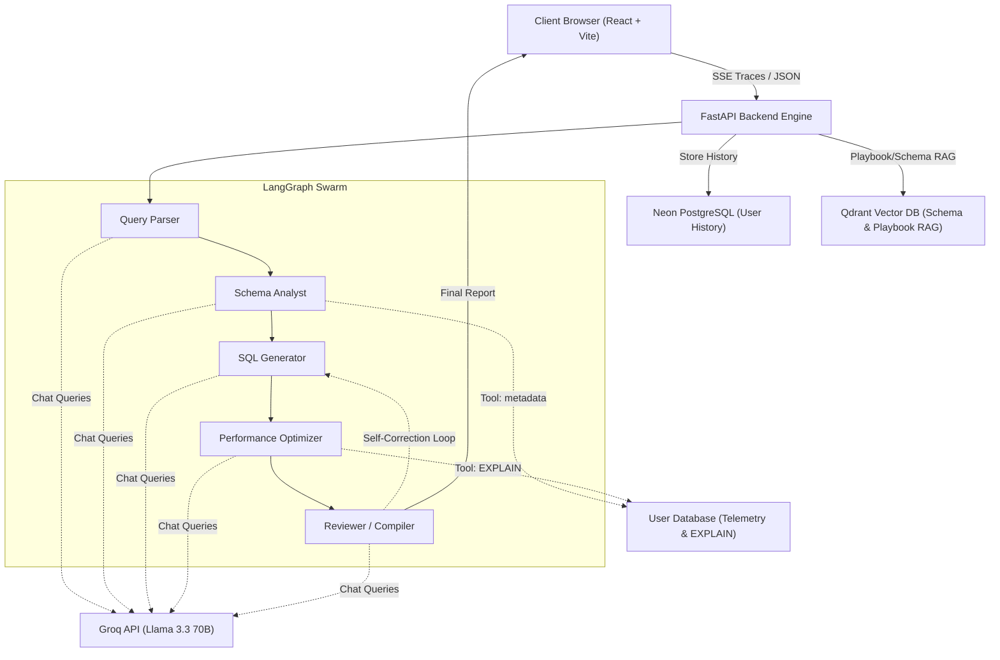

<div align="center">
  <h1>✨ QuerySage</h1>
  <p><strong>Agentic AI-Powered SQL Query Optimizer & Database Architect</strong></p>
  <p><strong>🔗 Live Demo: <a href="https://querysage.vercel.app/">https://querysage.vercel.app/</a></strong></p>
  
  <p>
    
    
    
    
    
    
    
    
  </p>
</div>

---

## 📖 Overview

**QuerySage** is an autonomous, multi-agent AI system designed to analyze, optimize, and document database queries. Powered by a collaborative team of specialized LLM agents structured via LangGraph, QuerySage evaluates query complexity, inspects database schemas, runs cost-check simulation loops (to catch sequential scans and high-cost joins), and generates dialect-specific optimization reports.

The application features a modern glassmorphism dark-mode interface with typewriter-style terminal traces, interactive entity-relationship diagrams (ERDs), live database telemetry (cache hit ratios, slow queries, missing indexes), and non-destructive index simulation.

---

## 🚀 Key Features

- 🧠 **Autonomous Agent Swarm (LangGraph):** A team of 5 specialized agents (`Query Parser`, `Schema Analyst`, `Deep Optimizer`, `Index Advisor`, and `Result Compiler`) work together to optimize SQL. If the compiler detects a high-cost rewrite, it triggers a self-correction loop to regenerate an optimal query.
- ⚡ **Real-Time Agent Tracing:** Live terminal typewriter logs stream agent actions (`✓ Analyzing Schema`, `✓ Running Explain`, `↻ High cost detected. Triggering self-correction loop...`), giving users visibility into the AI's step-by-step logic.
- 📚 **RAG-Powered context Routing:** Integrates with Qdrant to load DB dialect playbooks and historical optimization profiles. Groq handles semantic context extraction and query comparison routing.
- 📊 **Visual ERD Canvas:** Auto-parses standard SQL DDL schema definitions into dynamic nodes and interactive relationships on a responsive canvas.
- ⏱️ **Live Database Telemetry:** Connect securely to target databases (PostgreSQL or MySQL) to fetch active sessions, cache hit ratios, missing indexes, and extract execution plans (`EXPLAIN ANALYZE`).
- 👥 **Auth & History Persistence:** Complete user history tracking, sharing, and session authentication powered by Clerk.

---

## 🏗️ Architecture


```mermaid
graph TD
    %% Core Nodes
    Client["Client Browser (React + Vite)"]
    PythonAPI["FastAPI Backend Engine"]
    Neon["Neon PostgreSQL (User History)"]
    Qdrant["Qdrant Vector DB (Schema & Playbook RAG)"]
    LLM["Groq API (Llama 3.3 70B)"]
    LiveDB["User Database (Telemetry & EXPLAIN)"]

    %% LangGraph Agents
    subgraph "LangGraph Swarm"
        Parser["Query Parser"]
        Schema["Schema Analyst"]
        Gen["SQL Generator"]
        Opt["Performance Optimizer"]
        Rev["Reviewer / Compiler"]
    end

    %% Edges
    Client -->|"SSE Traces / JSON"| PythonAPI
    PythonAPI -->|"Store History"| Neon
    PythonAPI -->|"Playbook/Schema RAG"| Qdrant
    PythonAPI --> Parser
    Parser --> Schema
    Schema --> Gen
    Gen --> Opt
    Opt --> Rev
    Rev -.->|"Self-Correction Loop"| Gen
    Rev -->|"Final Report"| Client
    
    %% API Integrations
    Schema -.->|"Tool: metadata"| LiveDB
    Opt -.->|"Tool: EXPLAIN"| LiveDB
    
    %% Core LLM calls
    Parser & Schema & Gen & Opt & Rev -.->|"Chat Queries"| LLM
```

---

## 🛠️ Technology Stack

- **Frontend:** React, Vite, Tailwind CSS, Shadcn UI, React Flow, Zustand, TanStack Query
- **Backend:** Python 3.11, FastAPI, LangGraph, LangChain, SQLAlchemy, Psycopg2-binary, PyMySQL, Uvicorn
- **Databases:** Neon PostgreSQL (Relational history storage via Drizzle ORM), Qdrant (RAG Vector Database)
- **APIs & Auth:** Groq API (LLM Optimizer & RAG Routing), Clerk (Session security)

---

## 📁 Repository Structure

```text
querysage/
├── frontend/             # React + Vite application (UI, Swarm Trace Terminal)
├── python-backend/       # FastAPI + LangGraph Engine (Agents, Tools, RAG)
│   ├── routes.py         # HTTP endpoints & SSE streaming routers
│   ├── graph.py          # LangGraph compilation & agent nodes
│   ├── rag.py            # Qdrant integration & Groq RAG matching pipelines
│   ├── database.py       # SQLAlchemy database connection setup
│   ├── models.py         # Relational schema tables (QueryHistory, SchemaHistory)
│   └── tools.py          # LangChain SQL metadata tools (EXPLAIN, get_schema)
├── lib/                  # Shared Workspace Libraries
│   ├── db/               # Drizzle ORM schema & Neon DB migrations
│   ├── api-zod/          # Zod contract specs
│   ├── api-spec/         # API specifications
│   └── api-client-react/ # Generated API client hooks for React
├── scripts/              # Build & automation scripts
├── package.json          # Root monorepo configuration
└── pnpm-workspace.yaml   # Monorepo workspaces definition
```

---

## ⚙️ Environment Configuration

### Python Backend (`python-backend/.env`)
Create a `.env` file in the `python-backend/` directory:

```env
# Neon PostgreSQL Connection URL
DATABASE_URL=postgresql://<user>:<password>@<host>/<db>?sslmode=require

# Groq LLM API Key (Primary Optimizer & RAG Router)
GROQ_API_KEY=gsk_...

# Qdrant Vector Database
QDRANT_URL=http://localhost:6333
QDRANT_API_KEY=...           # Optional Qdrant API key

# Clerk Auth Config
CLERK_SECRET_KEY=sk_test_...
CLERK_FRONTEND_API=https://...
ENVIRONMENT=development
```

### Frontend (`frontend/.env.development`)
Create an env file in the `frontend/` directory:

```env
VITE_CLERK_PUBLISHABLE_KEY=pk_test_...
VITE_API_URL=http://localhost:8000
```

---

## 🚀 Running Locally

### 1. Install Workspace Dependencies
QuerySage is set up as a PNPM monorepo. Install dependencies at the root level:
```bash
pnpm install
```

### 2. Run the Frontend
```bash
cd frontend
pnpm run dev
```
*Runs the React application on `http://localhost:5173`*

### 3. Run the Python Backend
Ensure Python 3.11+ is installed, then set up the FastAPI server:
```bash
cd python-backend
pip install -r requirements.txt
python main.py
```
*Runs the FastAPI backend on `http://localhost:8000` (auto-reloads on file changes)*

---
<div align="center">
  <i>"Writing performant SQL at the speed of thought."</i><br/>
  Built by <strong>Rishabh Singh</strong>
</div>
