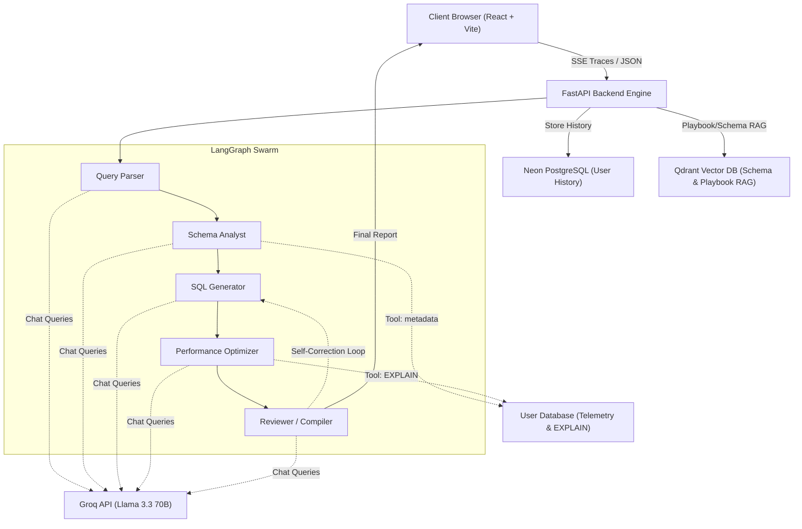

<div align="center">
  <h1>✨ QuerySage (V2 Flagship)</h1>
  <p><strong>Agentic AI-Powered SQL Query Optimizer & Database Architect</strong></p>
  <p><strong>🔗 Live Demo: <a href="https://querysage.vercel.app/">https://querysage.vercel.app/</a></strong></p>
  
  <p>
    
    
    
    
    
    
  </p>
</div>

---

## 📖 Overview

**QuerySage V2** is an autonomous, **Agentic AI Database Tuning & Architecture Suite** powered by LangGraph. It models a team of expert Database Administrators (DBAs) that collaboratively parse, analyze, generate, evaluate, and compile optimized SQL query reports. 

Featuring a sleek glassmorphism-inspired dark interface, QuerySage lets you visualize real-time agent typewriter traces, dynamically map schema DDL into interactive Entity Relationship Diagrams (ERDs), inspect live slow queries using active database connection telemetry, and run simulated index checks without modifying production environments.

---

## 🚀 Key Features

- 🧠 **Autonomous Agent Swarm (LangGraph):** A multi-agent team (`Query Parser` ➔ `Schema Analyzer` ➔ `Deep Optimizer` ➔ `Index Advisor` ➔ `Result Compiler`) resolves performance issues. The engine automatically runs self-correction loops when high-cost execution patterns (like sequential scans) are detected.
- ⚡ **Dynamic Agent Trace UI:** Watch the agents collaborate in real-time. Typewriter-style logs stream individual agent activities (`✓ Analyzing Schema`, `✓ Running Explain`, `↻ High cost detected. Triggering self-correction loop...`).
- 📚 **RAG-Infused SQL Playbook:** The RAG system matches raw input query dialects against custom DBA playbook guidelines stored in Qdrant Vector DB, dynamically injecting tailored rules (e.g., PostgreSQL partial index patterns, MySQL index hints).
- 📊 **Interactive ERD & Schema Builder:** Generate schema DDL using natural language prompts, instantly parse CREATE TABLE statements, and view them on a fully responsive nodes canvas.
- ⏱️ **Live Database Telemetry:** Connect to target database instances securely to poll performance stats (e.g., active connections, cache hit ratios, missing indexes, and slow queries).
- 👥 **Clerk Authentication & Workspaces:** Robust access control, user authorization, and history persistence utilizing Clerk.

---

## 🏗️ Architecture


```mermaid
graph TD
    %% Core Nodes
    Client["Client Browser (React + Vite)"]
    PythonAPI["FastAPI Backend Engine"]
    Neon["Neon PostgreSQL (User History)"]
    Qdrant["Qdrant Vector DB (Schema & Playbook RAG)"]
    LLM["Groq API (Llama 3.3 70B)"]
    LiveDB["User Database (Telemetry & EXPLAIN)"]

    %% LangGraph Agents
    subgraph "LangGraph Swarm"
        Parser["Query Parser"]
        Schema["Schema Analyst"]
        Gen["SQL Generator"]
        Opt["Performance Optimizer"]
        Rev["Reviewer / Compiler"]
    end

    %% Edges
    Client -->|"SSE Traces / JSON"| PythonAPI
    PythonAPI -->|"Store History"| Neon
    PythonAPI -->|"Playbook/Schema RAG"| Qdrant
    PythonAPI --> Parser
    Parser --> Schema
    Schema --> Gen
    Gen --> Opt
    Opt --> Rev
    Rev -.->|"Self-Correction Loop"| Gen
    Rev -->|"Final Report"| Client
    
    %% API Integrations
    Schema -.->|"Tool: metadata"| LiveDB
    Opt -.->|"Tool: EXPLAIN"| LiveDB
    
    %% Core LLM/Embedding calls
    Parser & Schema & Gen & Opt & Rev -.->|"Chat Queries"| LLM
```

---

## 🛠️ Technology Stack

- **Frontend:** React, Vite, Tailwind CSS, Shadcn UI, React Flow, Zustand
- **Backend:** Python 3.11, FastAPI, LangGraph, LangChain, SQLAlchemy, Uvicorn
- **Databases:** Neon PostgreSQL (Metadata & history), Qdrant (RAG Vector Store)
- **APIs & Auth:** Groq (LLM engine & RAG Router), Clerk (Session security)

---

## ⚙️ Environment Configuration

Create a `.env` file in the `python-backend/` directory:

```env
# Database Configuration (Neon PostgreSQL)
DATABASE_URL=postgresql://<user>:<password>@<host>/<db>?sslmode=require

# AI Model Credentials
GROQ_API_KEY=gsk_...         # Primary LLM Optimizer (Llama 3.3) & RAG routing

# Vector Database (RAG Playbook)
QDRANT_URL=http://localhost:6333
QDRANT_API_KEY=...           # Optional Qdrant API key

# Clerk Auth
CLERK_SECRET_KEY=sk_test_...
CLERK_FRONTEND_API=https://...
ENVIRONMENT=development
```

---

## 🚀 Running Locally

### 1. Backend Setup
```bash
cd python-backend
pip install -r requirements.txt
python main.py
```
*Runs backend server locally on `http://localhost:8000`*

### 2. Frontend Setup
Make sure you have your Clerk keys in `frontend/.env.development`:
```env
VITE_CLERK_PUBLISHABLE_KEY=pk_test_...
VITE_API_URL=http://localhost:8000
```

```bash
cd frontend
pnpm install
pnpm run dev
```

---

## 📁 Repository Structure

```text
querysage/
├── frontend/             # React + Vite application
│   ├── src/
│   │   ├── components/   # UI elements (Agent Swarm UI, Explain Graph, ERD)
│   │   ├── pages/        # Main pages (Landing, Optimizer Chat, Stats Page)
│   │   └── utils/        # Parsers & Helper utilities
├── python-backend/       # FastAPI LangGraph application
│   ├── routes.py         # SSE & HTTP endpoints
│   ├── graph.py          # LangGraph structure & Node definitions
│   ├── rag.py            # Local SQL and text-based keyword RAG pipelines
│   └── tools.py          # Database inspection tools
```

---
<div align="center">
  <i>"Writing performant SQL at the speed of thought."</i><br/>
  Built by <strong>Rishabh Singh</strong>
</div>
